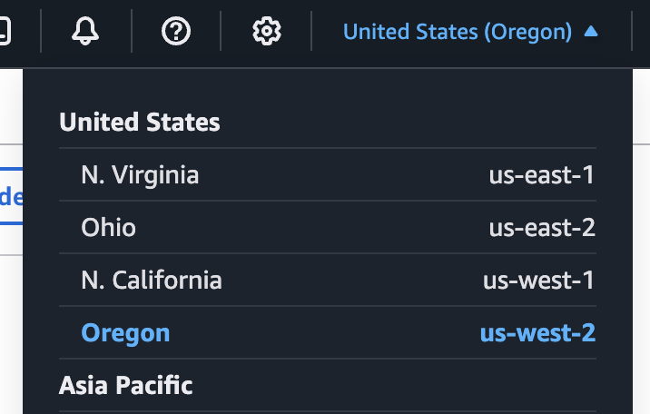
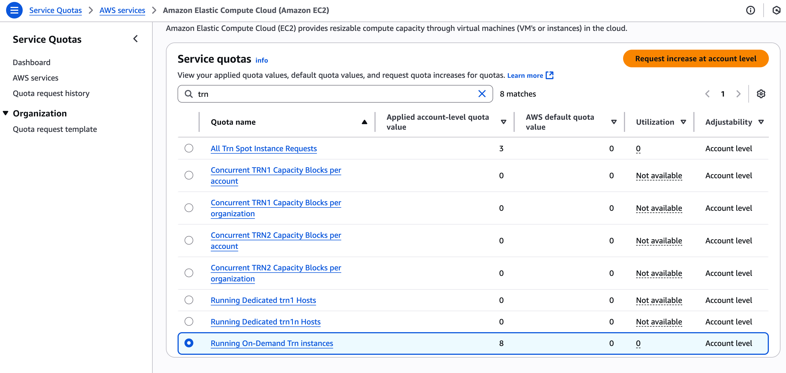
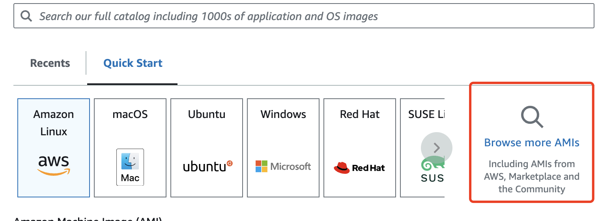
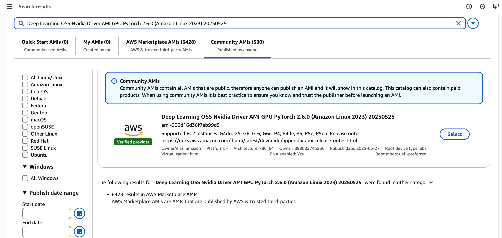
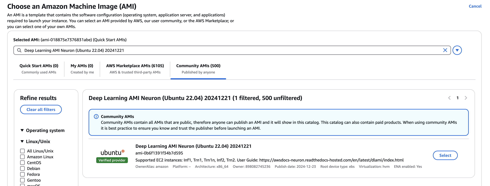
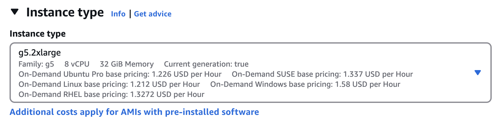
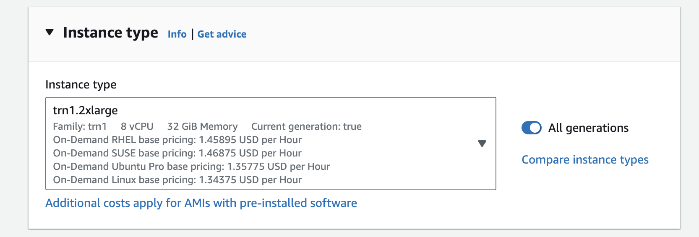
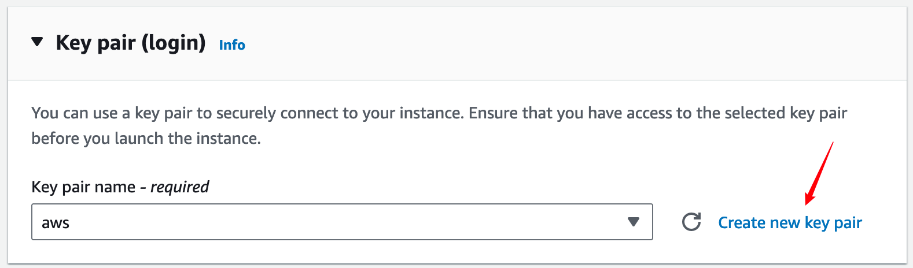
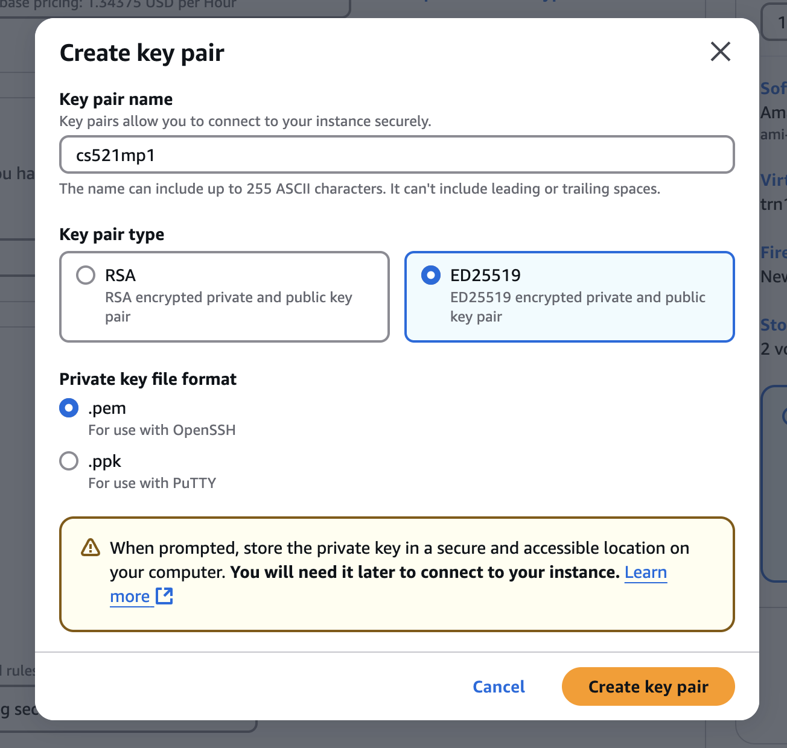
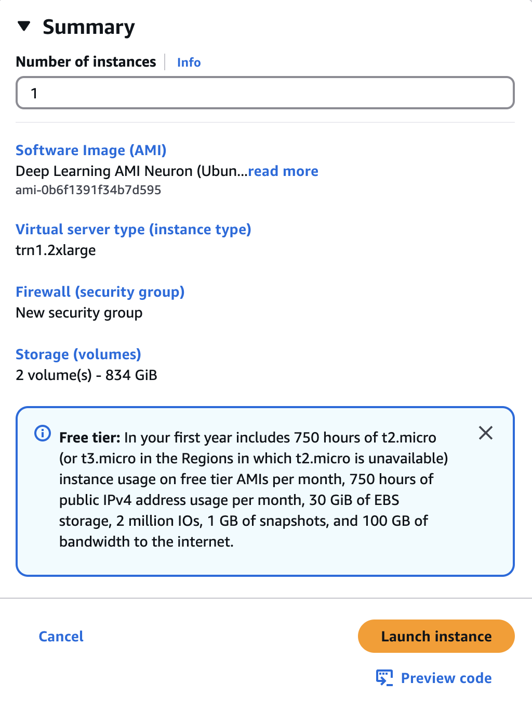

# AWS Setup Instructions #

For performance testing, you will need to run this assignment on a VM instance on Amazon Web Services (AWS). We'll be providing (or have already sent) you student coupons that you can use for billing purposes. Here are the steps for how to get setup for running on AWS.

> [!NOTE]
> Please don't forget to SHUT DOWN your instances when you're done for the day to avoid burning through credits overnight!

## Creating a VM ##

1. Log in to the [AWS EC2 dashboard](https://us-west-2.console.aws.amazon.com/console/home?region=us-west-2). On the top right of the page, make sure you are on the `us-west-2` region.

  

2. Before launching a VM, you will need to request resources for it. Go to [Service Quotas dashboard](https://us-west-2.console.aws.amazon.com/servicequotas/home/dashboard) and select Amazon EC2. For `npu` part, in the search bar type `Running On-Demand Trn instances`. Select it and click on `Request increase at account level`. Enter 8 vCPUs and submit the resource request. For 'gpu' part, search for `Running On-Demand G and VT instances` and request 8 vCPUs similarly. Keep in mind that this step might take a few days until Amazon approves your resource requests.

  

3. Now you're ready to create a VM instance. Go back to [AWS EC2](https://us-west-2.console.aws.amazon.com/ec2) and click on the button that says `Launch instance`.

  

3. Click on `Browse more AMIs` AMI.

  

4. For `gpu` instance, search for `Deep Learning OSS Nvidia Driver AMI GPU PyTorch 2.6.0 (Amazon Linux 2023) 20250525` in `Community AMIs`. For `npu` instance, search for `Deep Learning AMI Neuron (Ubuntu 22.04) 20241221` in `Community AMIs`. Click `Select`.

  
   
  <em>Deep Learning OSS Nvidia Driver AMI GPU PyTorch 2.6.0 (Amazon Linux 2023) 20250525</em>

  
   
  <em>Deep Learning AMI Neuron (Ubuntu 22.04) 20241221</em>

5. For `gpu` instance, choose the `g5.2xlarge` instance type. For `npu` instance, choose the `trn1.2xlarge` instance type.

  
   
  <em>g5.2xlarge instance</em>

  
   
  <em>trn1.2xlarge instance</em>

6. You will need a key pair to access your instance. In `Key pair (login)` section, click `Create a new key pair` and give it whatever name you'd like. This will download a keyfile to your computer called `<key_name>.pem` which you will use to login to the VM instance you are about to create. Finally, you can launch your instance.

  
  

7. Confirm all details and launch instance  

  

8. Now that you've created your VM, you should be able to __SSH__ into it. You need the public IPv4 DNS name to SSH into it, which you can find by navigating to your instance's page and then clicking the `Connect` button, followed by selecting the SSH tab (note, it may take a moment for the instance to startup and be assigned an IP address):

  

Make sure you follow the instructions to change the permissions of your key file by running `chmod 400 path/to/key_name.pem`.
Once you have the IP address, you can login to the instance. We are going to be using `neuron-profile` in this assignment, which uses InfluxDB to store profiler metrics. As a result, you will need to forward ports 3001 (the default neuron-profile HTTP server port) and 8086 (the default InfluxDB port) in order to view `neuron-profile` statistics in your browser. You can login to the instance while also forwarding the needed ports by running this command:
~~~~
ssh -i path/to/key_name.pem ubuntu@<public_dns_name> -L 3001:localhost:3001 -L 8086:localhost:8086
~~~~

> [!NOTE]
> Make sure you login as the user "ubuntu" rather than the user "root".

> [!WARNING]
> If you need to step away during setup after creating your instance, be sure to shut it down. Leaving it running could deplete your credits, and you may incur additional costs.

## Fetching your code from AWS ##

We recommend that you create a private git repository and develop your assignment in there. It reduces the risk of losing your code and helps you keep track of old versions.

Alternatively, you can also use `scp` command like following in your local machine to fetch code from a remote machine.
~~~~
scp -i <path-to-your-pem-file> ubuntu@<instance-IP-addr>:/path/to/file /path/to/local_file
~~~~

## Shutting down VM ##
When you're done using the VM, you can shut it down by clicking "stop computer" in the web page, or using the command below in the terminal.
~~~~
sudo shutdown -h now
~~~~
